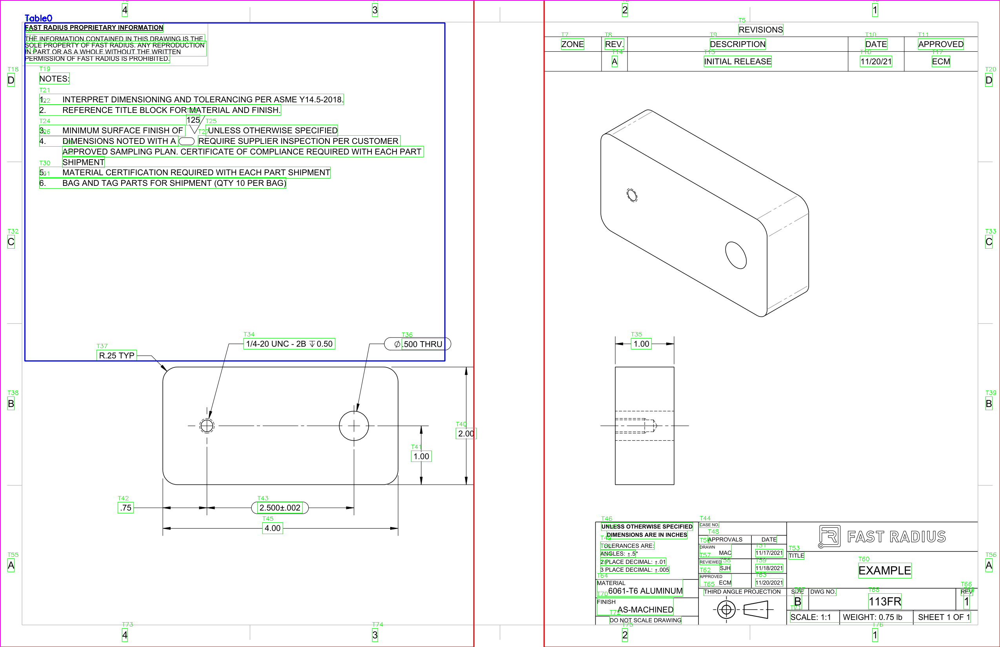
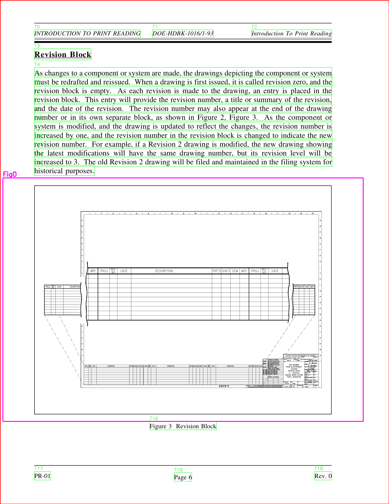
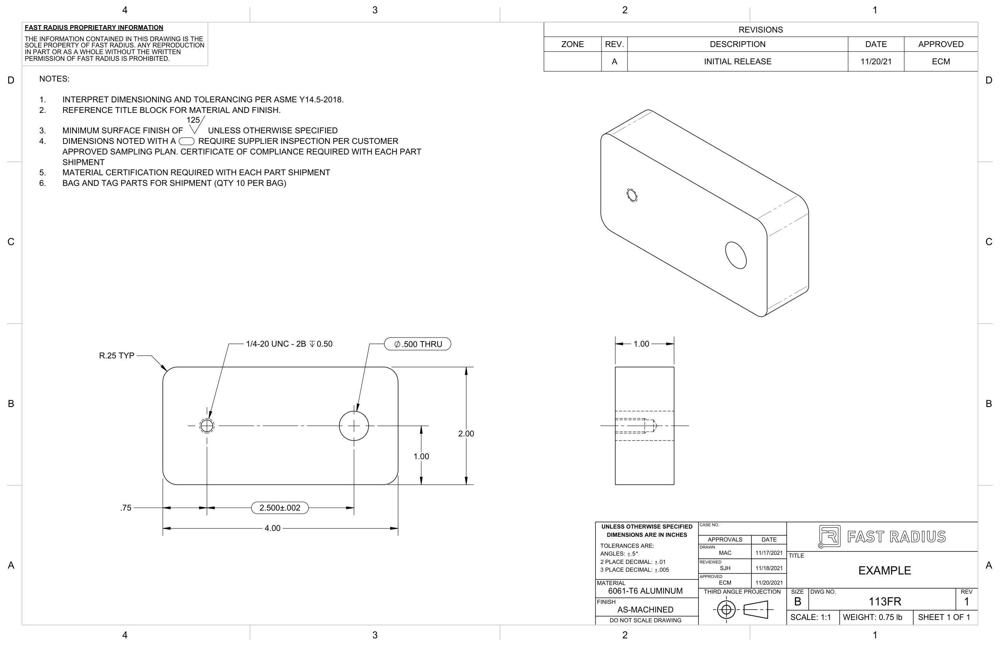
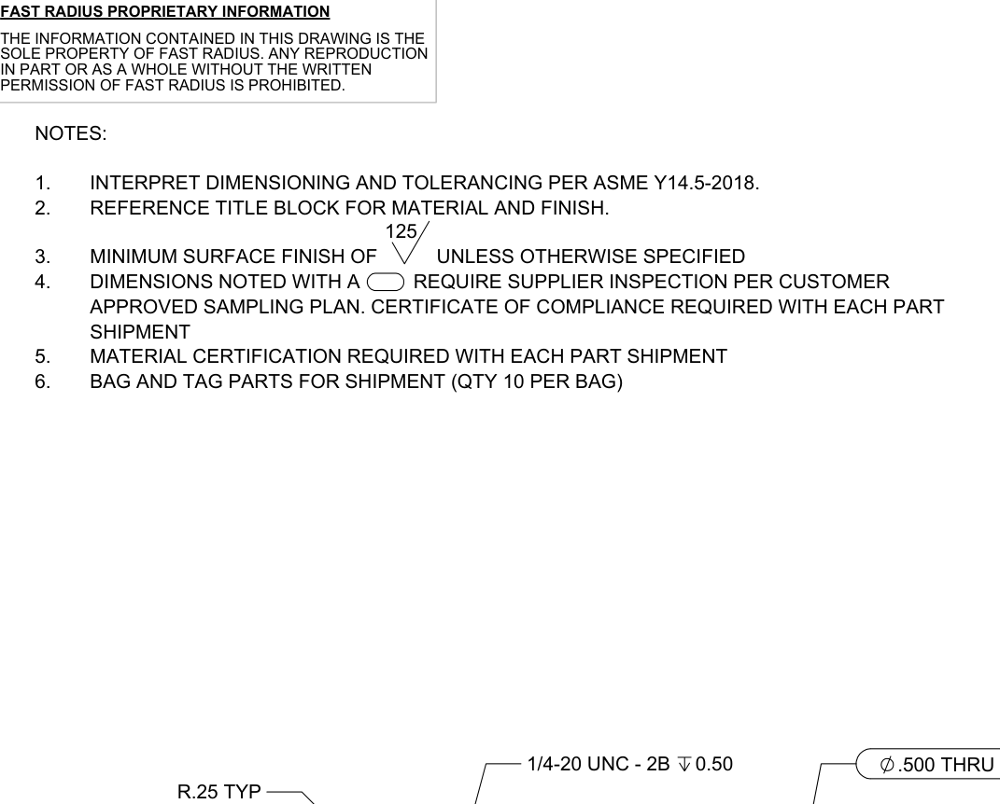
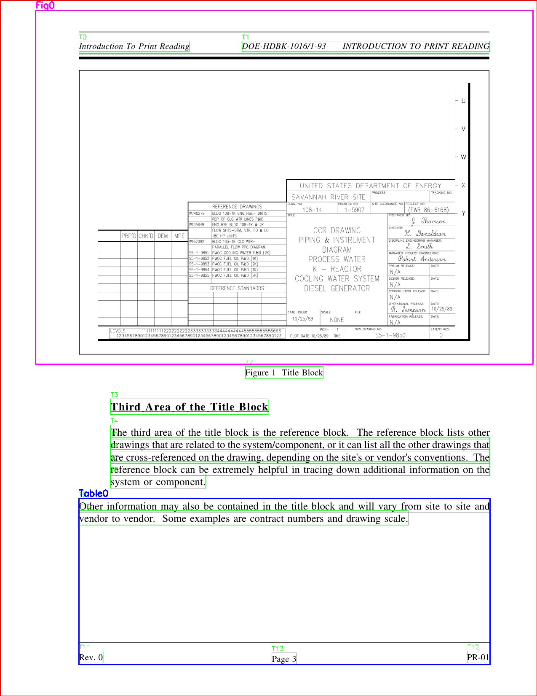

<div align="center">


# Quanta

**Advanced PDF Layout Analysis Engine**

[](https://www.python.org/downloads/)
[](https://opensource.org/licenses/MIT)
[](https://github.com/psf/black)
[](https://github.com/Magnet-AI/Quanta)

[](https://github.com/Magnet-AI/Quanta/issues)
[](https://github.com/Magnet-AI/Quanta/discussions)

</div>

---

A powerful and intelligent PDF layout analysis engine that automatically extracts figures, tables, and structured content from PDF documents using advanced computer vision and machine learning techniques.

**🎯 Problem Solved**: Complex engineering documents often lose critical visual information (figures, diagrams, technical drawings) when being parsed by traditional PDF tools. This engine specifically addresses the challenge of accurately detecting and extracting visual elements from technical and engineering PDFs that contain intricate layouts, multi-column designs, and embedded graphics.

<div align="center">
  
  <p><em>Debug overlay showing detected layout elements: columns (red), text blocks (green), figures (blue), and tables (yellow)</em></p>
</div>

## ✨ Features

- 🔍 **Multi-column Layout Detection** - Automatically identifies and processes complex multi-column layouts
- 📊 **Intelligent Table Recognition** - Detects both ruled and borderless tables with high accuracy
- 🖼️ **Figure Extraction** - Identifies and extracts figures, diagrams, and images
- 📝 **Text Block Analysis** - Groups and processes text blocks with proper reading order
- 🏷️ **Caption Linking** - Automatically links captions to their corresponding figures and tables
- 🎯 **High Accuracy** - Advanced algorithms ensure reliable content extraction
- ⚡ **Fast Processing** - Optimized for speed and efficiency
- 🛠️ **Easy Integration** - Simple API for integration into existing workflows
- 🔧 **Debug Mode** - Visualize layout analysis with overlay images

## 🚀 Quick Start

### Installation

```bash
# Clone the repository
git clone https://github.com/Magnet-AI/Quanta.git
cd Quanta

# Create virtual environment
python -m venv venv
source venv/bin/activate  # On Windows: venv\Scripts\activate

# Install dependencies
pip install -r requirements.txt

# Download YOLOv8 model (required for advanced detection)
pip install ultralytics
python -c "from ultralytics import YOLO; YOLO('yolov8l.pt')"
```

### Basic Usage

```python
from pdf_layout_engine import process_pdf

# Process a single PDF
result = process_pdf("document.pdf", "output/")

# Access results
print(f"Found {len(result['figures'])} figures and {len(result['tables'])} tables")
```

### Command Line Interface

```bash
# Process all PDFs in a directory
python main.py

# Debug mode - visualize layout analysis
python main.py --debug

# Process specific mode
python main.py --mode extract
```

## 📖 Documentation

### Core Concepts

#### Layout Analysis Pipeline
The engine follows a sophisticated multi-stage pipeline:

1. **PDF Rendering** - Converts PDF pages to high-resolution images
2. **Column Detection** - Identifies multi-column layouts using whitespace analysis
3. **Text Extraction** - Extracts and groups text blocks
4. **Figure Detection** - Identifies figures using vector clustering and image analysis
5. **Table Recognition** - Detects tables using both ruled and borderless methods
6. **Caption Linking** - Links captions to their corresponding figures/tables
7. **Reading Order** - Determines proper reading sequence

#### Mathematical Foundations

**Column Detection Algorithm:**
- Uses whitespace valley analysis to identify column boundaries
- Applies Gaussian smoothing to detect consistent vertical gaps
- Implements adaptive thresholding for varying document layouts

**Table Detection:**
- **Ruled Tables**: Hough line transform for line detection
- **Borderless Tables**: Cell density analysis and alignment detection
- **Grid Extraction**: Line intersection analysis for cell boundaries

**Figure Detection:**
- Vector clustering using DBSCAN algorithm
- Aspect ratio analysis to distinguish figures from tables
- Image XObject extraction for embedded graphics

### API Reference

#### `process_pdf(pdf_path: str, output_dir: str) -> Dict[str, Any]`

Process a PDF document and extract structured content.

**Parameters:**
- `pdf_path` (str): Path to the input PDF file
- `output_dir` (str): Directory to save extracted content

**Returns:**
- `Dict[str, Any]`: Processing results containing figures, tables, and metadata

**Example:**
```python
result = process_pdf("research_paper.pdf", "output/")

# Access extracted figures
for figure in result['figures']:
    print(f"Figure: {figure['caption']}")
    print(f"Bounding box: {figure['bbox']}")

# Access extracted tables
for table in result['tables']:
    print(f"Table: {table['caption']}")
    print(f"Cells: {len(table['cells'])}")
```

## 🎯 Use Cases

### Engineering & Technical Documents
- **Technical Drawings**: Extract engineering diagrams and CAD drawings
- **Specification Sheets**: Parse technical specifications and data tables
- **Engineering Reports**: Process complex multi-column technical reports
- **Manufacturing Docs**: Extract assembly instructions and part diagrams

### Academic Research
- Extract figures and tables from research papers
- Analyze document structure and layout
- Process large collections of academic PDFs

### Document Digitization
- Convert PDF documents to structured data
- Extract content for database storage
- Prepare documents for text analysis

### Content Management
- Automatically categorize document content
- Extract metadata and captions
- Generate document summaries

### Data Analysis
- Extract tabular data from reports
- Process financial documents
- Analyze technical specifications

## 🔧 Advanced Configuration

### Custom Parameters

```python
from pdf_layout_engine import process_pdf

# Custom processing parameters
config = {
    'min_figure_area': 1000,
    'table_detection_threshold': 0.7,
    'column_detection_sensitivity': 0.8
}

result = process_pdf("document.pdf", "output/", config=config)
```

### Debug Mode

Enable debug mode to visualize the layout analysis process:

```bash
python main.py --debug
```

This generates overlay images showing:
- 🔴 Red rectangles: Column boundaries
- 🟢 Green rectangles: Text blocks
- 🔵 Blue rectangles: Detected figures
- 🟡 Yellow rectangles: Detected tables

## 📊 Performance

### Current Benchmarks
- **Processing Speed**: ~2-5 seconds per page
- **Current Accuracy**: ~80% for figures and tables
- **Memory Usage**: ~200MB for typical documents
- **Supported Formats**: PDF 1.4 - PDF 2.0

### 🚧 **Active Development**
We're currently fine-tuning our base models to improve accuracy. The engine is in active development with regular updates to enhance detection performance. We're working towards achieving 90%+ accuracy through:
- Model fine-tuning on engineering document datasets
- Improved preprocessing pipelines
- Enhanced feature extraction algorithms
- Community feedback integration

### Optimization Tips
- Use high-resolution rendering for better accuracy
- Adjust parameters based on document type
- Process pages in parallel for batch operations
- Use debug mode to tune detection parameters

## 🖼️ Examples

### Debug Overlay Analysis
<div align="center">
  
  <p><em>Debug overlay showing detected layout elements: columns (red), text blocks (green), figures (blue), and tables (yellow)</em></p>
</div>

### Engineering Document Processing
<div align="center">
  
  <p><em>Complex engineering document with multi-column layout and technical drawings</em></p>
</div>

### Extracted Figure
<div align="center">
  
  <p><em>Automatically extracted figure from PDF document</em></p>
</div>

### Extracted Table
<div align="center">
  
  <p><em>Automatically extracted table with preserved formatting</em></p>
</div>

### Multi-Page Analysis
<div align="center">
  
  <p><em>Consistent layout analysis across multiple pages of technical documents</em></p>
</div>

## 🤝 Contributing

We welcome contributions! Please see our [Contributing Guide](CONTRIBUTING.md) for details.

### Development Setup

```bash
# Install in development mode
pip install -e ".[dev]"

# Run tests
pytest

# Run with coverage
pytest --cov=src
```

## 📄 License

This project is licensed under the MIT License - see the [LICENSE](LICENSE) file for details.

## 🙏 Acknowledgments

- Built with [PyMuPDF](https://pymupdf.readthedocs.io/) for PDF processing
- Uses [OpenCV](https://opencv.org/) for computer vision operations
- Inspired by research in document layout analysis

## 📞 Support

- 📧 Email: sovitnayak1258@gmail.com
- 🐛 Issues: [GitHub Issues](https://github.com/Magnet-AI/Quanta/issues)
- 💬 Discussions: [GitHub Discussions](https://github.com/Magnet-AI/Quanta/discussions)

---

**Made with ❤️ for the open source community**